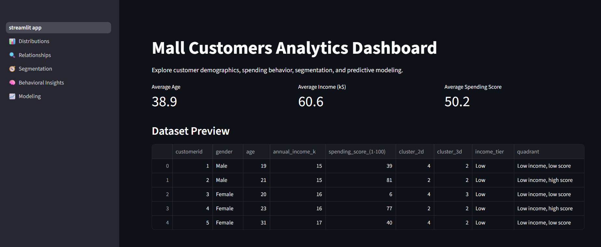
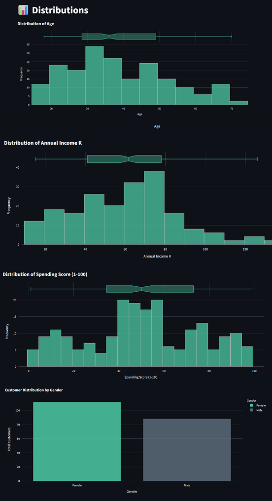
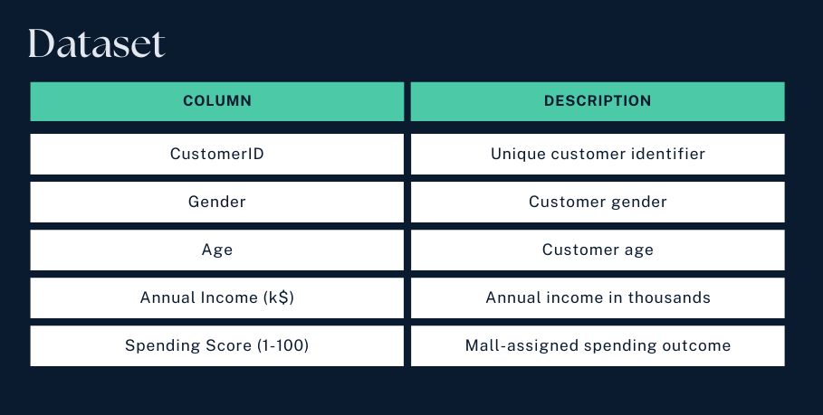

# 📘 Mall Customers Analytics Dashboard

A complete end‑to‑end customer segmentation and behavioral insights project

## 📌 Overview
This project transforms the classic **Mall Customers dataset** into a fully interactive analytics product.
It includes:

- Clean data processing
- Exploratory data analysis
- Customer segmentation using K‑Means
- Behavioral insights
- Predictive modeling
- A multi‑page **Streamlit dashboard** with **Plotly** interactive charts
- A custom **Modern palette** (deep navy, electric blue, soft teal)

The goal is to demonstrate how even a small dataset can support a complete analytical workflow and a polished, user‑friendly interface.

## 🖼️ Screenshots

**Dashboard Home**

**Distributions Page**

**Segmentation Page**

**Behavioral Insights**

## 🧭 Features

✔️ Multi‑Page Streamlit App

Organized using st.pages:
- Overview
- Distributions
- Relationships
- Segmentation
- Behavioral Insights
- Modeling

✔️ Fully Interactive Visualizations

Powered by Plotly:
- Histograms
- Scatterplots
- PCA projections
- Cluster visualizations
- Heatmaps

✔️ Customer Segmentation

K‑Means clustering (2D + 3D)
- PCA visualization
- Cluster profiling

✔️ Behavioral Analysis

Income vs spending quadrants
- Income tier comparisons
- Segment narratives

✔️ Predictive Modeling

Linear Regression
- Random Forest
- Feature importance

## 📊 Dataset

## 🧠 Key Insights
- Income and spending score are not strongly correlated
- Younger customers tend to have higher spending scores
- K‑Means reveals clear, interpretable customer segments
- Quadrant analysis highlights high‑potential customer groups
- Predictive models show income is the strongest driver of spending score

## 📜 License
This project is licensed under the MIT License.

## 🙌 Acknowledgments
This project was built to demonstrate a complete analytical workflow, combining data science, and interactive visualization into a cohesive portfolio piece.
